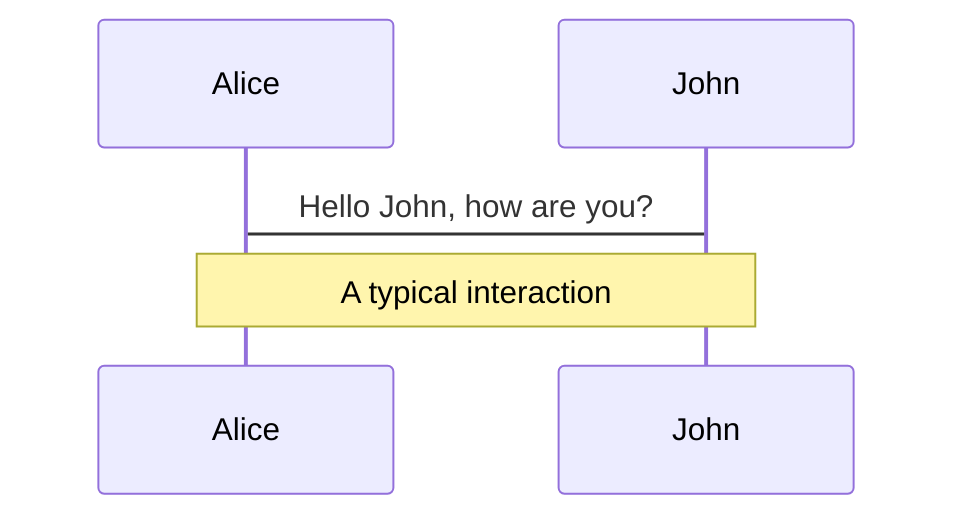
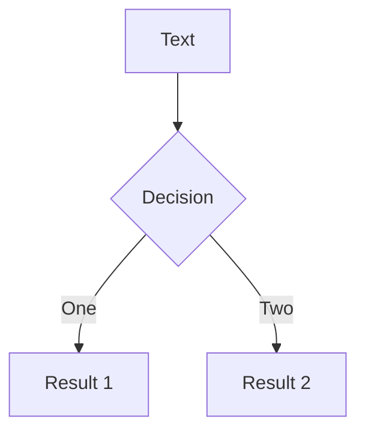

---
# try also 'default' to start simple
theme: light-icons
colorSchema: light

fonts:
  # like font-family in css, you can use `,` to separate multiple fonts for fallback
  sans: 'Lato, Noto Sans JP'
  serif: 'Lato, Noto Sans JP'

# first page
layout: image-right
image: 'https://vitejs.dev/logo.svg'
---

<style>
  body {
    font-size: 20px;
  }
  h1 {
    line-height: 1.4 !important;
    font-weight: bold !important;
  }
  body ul {
    padding-left: 24px;
  }
  ul ul {
    font-size: .9rem;
  }
  li {
    list-style-type: initial;
  }
  li + li {
    margin-top: .8rem;
  }
</style>

# 次世代フロントエンドツールVite入門会

2021/10/30(Sat) 10:00〜 / 主催: [@Meijin_garden](https://twitter.com/Meijin_garden)

---
layout: image-right
image: https://raw.githubusercontent.com/lightvue/slidev-theme-light-icons/master/static/light-icons-cover.svg
---

# イベント概要

- **環境構築** - [Vite](http://vitejs.dev/)の公式ガイドに則って、環境構築から一通りの機能を使うところまで進めます
- **プラスアルファ** - 終わったらStorybookを入れたり、プラグインを入れたり、Vercelにホスティングしたり各自興味のある活動をします

<br />

※なんとなくイベント立ち上げたらめっちゃ登録数があっておののいています

※なので、**チャットや会話で盛り上げて**いただけると助かりますｗ


---
layout: image-right
image: https://raw.githubusercontent.com/lightvue/slidev-theme-light-icons/master/static/light-icons-cover.svg
---

# 予定

- 自己紹介
  - 主催
  - 話す枠の方々
- 画面共有して環境構築開始
  - HMR, pre-bundle, plugin, CSS Modules, env variables and mode...など
  - あくまで入門会なので、公式ドキュメントを順になぞります
- 感想など雑談
  - この場で皆に質問したいことがあればチャット等で募集とか
- 時間に余裕があればプラスアルファなにかやる
- 解散

---
layout: image-right
image: https://raw.githubusercontent.com/lightvue/slidev-theme-light-icons/master/static/light-icons-cover.svg
---

# 自己紹介

- 「名人」というニックネームで活動
- Twitter: <span class="ml-2 text-[#1d9bf0] font-bold">@Meijin_garden</span>
- Webエンジニア6年目
- 好きな分野はWebフロントエンド
- 好きなエディタのテーマはPanda
- 趣味は将棋（初段くらい）
- 株式会社NoSchool CTO
  - オンライン家庭教師マナリンク -> https://manalink.jp

---
layout: image-right
image: https://raw.githubusercontent.com/lightvue/slidev-theme-light-icons/master/static/light-icons-cover.svg
---

# 話す枠の方々の自己紹介

- お名前
- 好きな技術
- Viteとの関わり

---
layout: image-header-intro
---

# 環境構築

---
layout: image-right
image: https://raw.githubusercontent.com/lightvue/slidev-theme-light-icons/master/static/light-icons-illustration.svg
---

# create vite app

- https://vitejs.dev/guide/#scaffolding-your-first-vite-project

<br />

React & TypeScriptで書きたい場合

```shell
yarn create vite react-application --template react-ts
```

---
layout: image-right
image: https://raw.githubusercontent.com/lightvue/slidev-theme-light-icons/master/static/light-icons-illustration.svg
---

# use templates (optional)

- degitを使えばtemplateから簡単に開始できます。

```shell
npx degit TeXmeijin/vite-react-ts-tailwind-firebase-starter vite-hoge
```

- 以下は自作のテンプレです


---
layout: image-right
image: https://raw.githubusercontent.com/lightvue/slidev-theme-light-icons/master/static/light-icons-illustration.svg
---

# yarn dev

```shell
yarn
yarn dev
```


---
layout: image-right
image: https://raw.githubusercontent.com/lightvue/slidev-theme-light-icons/master/static/light-icons-illustration.svg
---

# index.html

- SPAなのでHTMLはindex.htmlのみ
- 基本的にはドキュメントルートにindex.htmlがあります
- `<html>`のlang="ja"とかはここで変える

---
layout: image-right
image: https://raw.githubusercontent.com/lightvue/slidev-theme-light-icons/master/static/light-icons-illustration.svg
---

# pre-bundle

- https://vitejs.dev/guide/features.html#npm-dependency-resolving-and-pre-bundling
- esbuildが依存をバンドルして`node_modules/.vite`以下に配置してくれる

```shell
Pre-bundling dependencies:
  react
  react-dom
  react/jsx-dev-runtime
(this will be run only when your dependencies or config have changed)
```


---
layout: image-right
image: https://raw.githubusercontent.com/lightvue/slidev-theme-light-icons/master/static/light-icons-illustration.svg
---

# pre-bundle (2)

- 起動中にライブラリを追加し、新しいimportを追加すると再度Prebundleが走るっぽい

```shell
yarn add @chakra-ui/react @emotion/react @emotion/styled framer-motion
```

```tsx
import { Button, ButtonGroup } from "@chakra-ui/react"
// 本当はProviderとか要るけど雑に追加
        <Button>
          hoge
        </Button>
```

```shell
18:26:01 [vite] ✨ dependencies updated, reloading page...
```


---
layout: image-right
image: https://raw.githubusercontent.com/lightvue/slidev-theme-light-icons/master/static/light-icons-illustration.svg
---

# pre-bundle (3)

- TSXコンポーネントを作ったり、Hookを切ってimportすると、それらも別個のファイルでリクエストされる
- 手元の実運用中のViteアプリケーションでは1画面で300以上のリクエストが飛んでる
  - 手元のNuxtアプリケーションでは170程度なので多いほうと思われる
  - 依存しているファイル数だけリクエストが増えるので当然といえば当然

---
layout: image-right
image: https://raw.githubusercontent.com/lightvue/slidev-theme-light-icons/master/static/light-icons-illustration.svg
---

# plugin

- vite本体はシンプルな機能で、プラグインを足していく

Reactの場合のデフォルトは:

```ts
import { defineConfig } from 'vite'
import react from '@vitejs/plugin-react'

// https://vitejs.dev/config/
export default defineConfig({
  plugins: [react()]
})
```

---

# What is Slidev?

Slidev is a slides maker and presenter designed for developers, consist of the following features

- 📝 **Text-based** - focus on the content with Markdown, and then style them later
- 🎨 **Themable** - theme can be shared and used with npm packages
- 🧑‍💻 **Developer Friendly** - code highlighting, live coding with autocompletion
- 🤹 **Interactive** - embedding Vue components to enhance your expressions
- 🎥 **Recording** - built-in recording and camera view
- 📤 **Portable** - export into PDF, PNGs, or even a hostable SPA
- 🛠 **Hackable** - anything possible on a webpage

<br>
<br>

Read more about [Why Slidev?](https://sli.dev/guide/why)

<!--
You can have `style` tag in markdown to override the style for the current page.
Learn more: https://sli.dev/guide/syntax#embedded-styles
-->

<style>
h1 {
  background-color: #2B90B6;
  background-image: linear-gradient(45deg, #4EC5D4 10%, #146b8c 20%);
  background-size: 100%;
  -webkit-background-clip: text;
  -moz-background-clip: text;
  -webkit-text-fill-color: transparent; 
  -moz-text-fill-color: transparent;
}
</style>

---

# Navigation

Hover on the bottom-left corner to see the navigation's controls panel, [learn more](https://sli.dev/guide/navigation.html)

### Keyboard Shortcuts

|     |     |
| --- | --- |
| <kbd>right</kbd> / <kbd>space</kbd>| next animation or slide |
| <kbd>left</kbd>  / <kbd>shift</kbd><kbd>space</kbd> | previous animation or slide |
| <kbd>up</kbd> | previous slide |
| <kbd>down</kbd> | next slide |

<!-- https://sli.dev/guide/animations.html#click-animations -->

<p v-after class="absolute bottom-23 left-45 opacity-30 transform -rotate-10">Here!</p>

---
layout: image-right
---

# Code

Use code snippets and get the highlighting directly![^1]

```ts {all|2|1-6|9|all}
interface User {
  id: number
  firstName: string
  lastName: string
  role: string
}

function updateUser(id: number, update: User) {
  const user = getUser(id)
  const newUser = {...user, ...update}  
  saveUser(id, newUser)
}
```

<arrow v-click="3" x1="400" y1="420" x2="230" y2="330" color="#564" width="3" arrowSize="1" />

[^1]: [Learn More](https://sli.dev/guide/syntax.html#line-highlighting)

<style>
.footnotes-sep {
  @apply mt-20 opacity-10;
}
.footnotes {
  @apply text-sm opacity-75;
}
.footnote-backref {
  display: none;
}
</style>

---

# Components

<div grid="~ cols-2 gap-4">
<div>

You can use Vue components directly inside your slides.

We have provided a few built-in components like `<Tweet/>` and `<Youtube/>` that you can use directly. And adding your custom components is also super easy.

```html
<Counter :count="10" />
```

<!-- ./components/Counter.vue -->
<Counter :count="10" m="t-4" />

Check out [the guides](https://sli.dev/builtin/components.html) for more.

</div>
<div>

```html
<Tweet id="1390115482657726468" />
```

<Tweet id="1390115482657726468" scale="0.65" />

</div>
</div>


---
class: px-20
---

# Themes

Slidev comes with powerful theming support. Themes can provide styles, layouts, components, or even configurations for tools. Switching between themes by just **one edit** in your frontmatter:

<div grid="~ cols-2 gap-2" m="-t-2">

```yaml
---
theme: default
---
```

```yaml
---
theme: seriph
---
```


</div>

Read more about [How to use a theme](https://sli.dev/themes/use.html) and
check out the [Awesome Themes Gallery](https://sli.dev/themes/gallery.html).

---
preload: false
---

# Animations

Animations are powered by [@vueuse/motion](https://motion.vueuse.org/).

```html
<div
  v-motion
  :initial="{ x: -80 }"
  :enter="{ x: 0 }">
  Slidev
</div>
```

<div class="w-60 relative mt-6">
  <div class="relative w-40 h-40">
    
    
    
  </div>

  <div 
    class="text-5xl absolute top-14 left-40 text-[#2B90B6] -z-1"
    v-motion
    :initial="{ x: -80, opacity: 0}"
    :enter="{ x: 0, opacity: 1, transition: { delay: 2000, duration: 1000 } }">
    Slidev
  </div>
</div>

<!-- vue script setup scripts can be directly used in markdown, and will only affects current page -->
<script setup lang="ts">
const final = {
  x: 0,
  y: 0,
  rotate: 0,
  scale: 1,
  transition: {
    type: 'spring',
    damping: 10,
    stiffness: 20,
    mass: 2
  }
}
</script>

<div
  v-motion
  :initial="{ x:35, y: 40, opacity: 0}"
  :enter="{ y: 0, opacity: 1, transition: { delay: 3500 } }">

[Learn More](https://sli.dev/guide/animations.html#motion)

</div>

---

# LaTeX

LaTeX is supported out-of-box powered by [KaTeX](https://katex.org/).

<br>

Inline $\sqrt{3x-1}+(1+x)^2$

Block
$$
\begin{array}{c}

\nabla \times \vec{\mathbf{B}} -\, \frac1c\, \frac{\partial\vec{\mathbf{E}}}{\partial t} &
= \frac{4\pi}{c}\vec{\mathbf{j}}    \nabla \cdot \vec{\mathbf{E}} & = 4 \pi \rho \\

\nabla \times \vec{\mathbf{E}}\, +\, \frac1c\, \frac{\partial\vec{\mathbf{B}}}{\partial t} & = \vec{\mathbf{0}} \\

\nabla \cdot \vec{\mathbf{B}} & = 0

\end{array}
$$

<br>

[Learn more](https://sli.dev/guide/syntax#latex)

---

# Diagrams

You can create diagrams / graphs from textual descriptions, directly in your Markdown.

<div class="grid grid-cols-2 gap-10 pt-4 -mb-6">





</div>

[Learn More](https://sli.dev/guide/syntax.html#diagrams)


---
layout: center
class: text-center
---

# Learn More

[Documentations](https://sli.dev) · [GitHub](https://github.com/slidevjs/slidev) · [Showcases](https://sli.dev/showcases.html)
